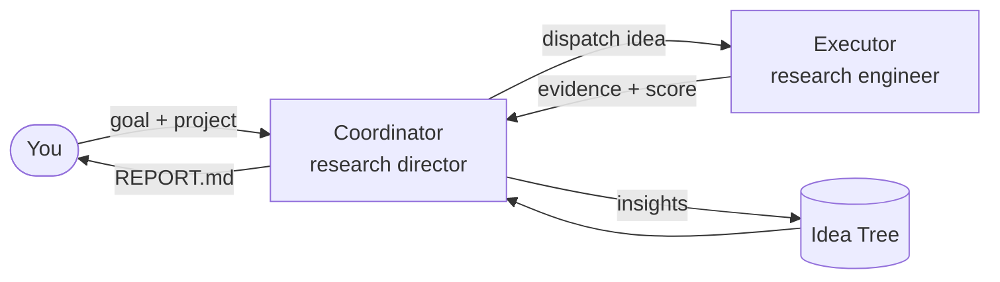

# How It Works

DevPilot turns a long-horizon objective into a structured, cumulative search. This page
explains the core ideas: the two agents, the devpilot cycle, the Idea Tree, git isolation,
evaluation discipline, and human-in-the-loop.

## Two agents



| Agent | Responsibility |
| --- | --- |
| **Coordinator** | Maintains the Idea Tree, decides what to explore next, dispatches experiments, and decides what to merge. It never writes experiment code itself. |
| **Executor** | Receives a single idea plus distilled context, implements it, runs the experiment in an isolated git worktree, and reports back structured evidence. |

This separation keeps strategy (which hypotheses are worth testing) apart from execution
(making one hypothesis real), so each agent can specialize.

## The devpilot cycle

The Coordinator drives the search as a repeating loop. Conceptually:

1. **Ideate.** Draft candidate hypotheses as children of a promising node — each a real
   mechanism, not a parameter tweak. (A [Skill](skills.md) enforces the quality bar.)
2. **Select.** Pick the most promising idea to test next, balancing exploitation of the
   current best line against exploration of new directions.
3. **Experiment.** Dispatch an Executor to implement and run the idea in isolation.
4. **Evaluate.** Read the resulting evidence and score against the dev signal.
5. **Backpropagate.** Abstract what was learned and propagate the insight up the tree so
   future ideas inherit it.
6. **Merge or prune.** Keep changes that clear the held-out gate; prune dead branches.

The loop continues until a stopping condition is met — a budget is exhausted, the search
converges, or a target is achieved.

## The Idea Tree

The Idea Tree is DevPilot's persistent memory. Every node is a hypothesis with its status,
the evidence it produced, and the insight distilled from it:

```text
root: maximize held-out accuracy
├── stronger augmentation pipeline        [merged]   +1.4
│   ├── mixup + cutmix                     [pruned]   overfits dev
│   └── test-time augmentation             [merged]   +0.6
└── swap backbone to ConvNeXt             [running]
```

Because the tree is the shared state, the agents never reconstruct context from a chat
log. The Coordinator reads the tree to decide what to do next; Executors receive only a
concise, relevant summary rather than a dump of every prior message. This is what lets
DevPilot sustain a long study without drowning in its own history.

### Backpropagated insight

After each experiment, an LLM abstracts *why* it succeeded or failed — "data leakage in
fold construction", "the gain comes from calibration, not the new layer" — and writes that
insight back up the tree. Sibling and descendant ideas then start from that knowledge
instead of rediscovering it.

## Git isolation

Every experiment runs on its own branch in a dedicated **git worktree** branched from
trunk. This means:

- Experiments are **parallel-safe** and never clobber each other.
- Your working tree and `main` are **untouched** until you merge.
- Committed trunk artifacts **propagate automatically** to new worktrees, so a merged
  improvement is available to every subsequent experiment.
- Everything is **reversible** — a failed branch is simply discarded.

By default DevPilot refuses to start from a non-base branch; use `--allow-non-base-branch`
when you intentionally want to build on a feature branch.

## Evaluation discipline

The single most important guardrail against self-deception is the split between the signal
executors optimize and the signal that decides what's kept:

- **Dev signal** — executors iterate against this freely.
- **Held-out gate** — a change is merged only if it improves the held-out metric by a
  configurable margin.

This margin-based merge gate is what stops the agent from "improving" by overfitting the
iteration signal. The metric and its direction (`maximize`/`minimize`) come from your
project's README and eval script — see [Preparing a Benchmark](preparing-a-benchmark.md).

## Human-in-the-loop

DevPilot runs fully autonomously by default, but you can dial in oversight with interaction
modes:

| Mode | Behaviour |
| --- | --- |
| `auto` | Fully autonomous — no prompts. |
| `direction` | The agent asks **where to explore** at key junctions. |
| `review` | The agent asks you to **approve or edit ideas** before running them. |
| `collaborative` | Both direction and review gates are active. |

Set the mode with `--interaction-mode` (alias `--mode`) or in config under `ui:`. During a
run you can also steer with [slash commands](cli.md#interactive-slash-commands) like
`/tree`, `/evidence`, `/pause`, and `/resume`.

## Putting it together

The result is a research process that **accumulates** rather than restarts: hypotheses are
proposed deliberately, tested in isolation, judged on held-out data, and distilled into
insight that makes the next round smarter — all recorded in a tree you can inspect, steer,
and resume.
